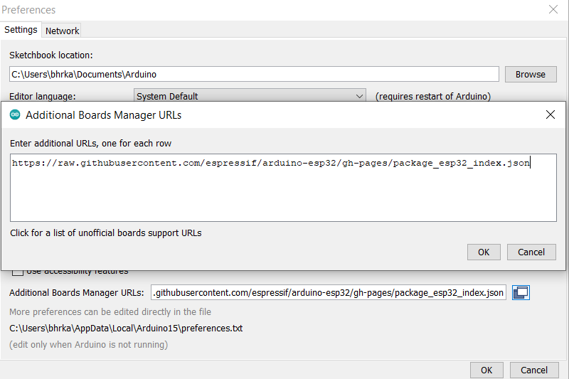

# M5Stask Quickstart

To start working with M5Stack board you should follow these steps:\

1- [Prepare a m5stack board :D](#prepare-a-m5stack-board)

2- [Install Arduino IDE](#install-arduino-ide)

3- [Install the Arduino-ESP32 support](#install-the-arduino-ESP32-support)

4- 


## Prepare a m5stack board

The main site for buying the m5stack board is its official site: https://m5stack.com/

// TODO: add more links which sell m5stack boards (especially in Iran)

## Install Arduino IDE

Download and install the [parduino-1.8.19-windows](https://downloads.arduino.cc/arduino-1.8.19-windows.exe) version of arduino IDE. 
At the time I'm writing this documentation, arduino-2 was not a stable option to work with m5stack. 
But you can test new versions.

## Install the Arduino-ESP32 support

Based on [this link](https://docs.espressif.com/projects/arduino-esp32/en/latest/installing.html)
add this package to the "File > Preferences > Additional Board Manager URLs":

```
https://raw.githubusercontent.com/espressif/arduino-esp32/gh-pages/package_esp32_index.json
```

<p align="center">
  
</p>

