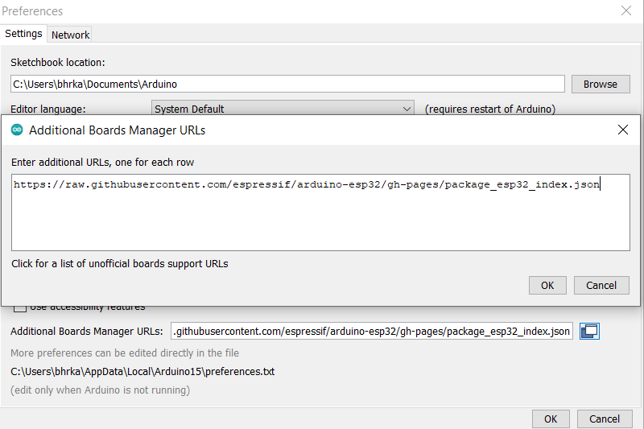
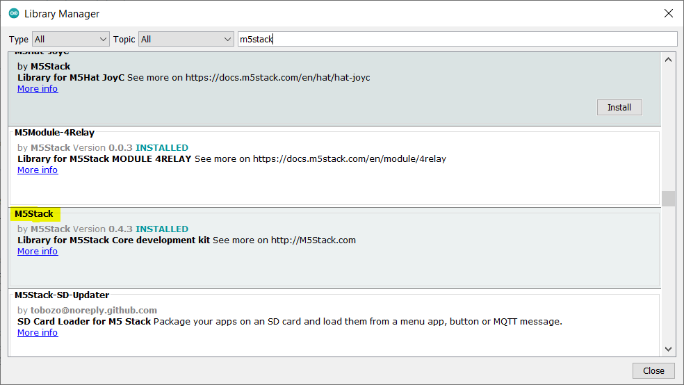

# M5Stask Quickstart

To start working with M5Stack board you should follow these steps:

1- [Prepare a m5stack board :D](#prepare-a-m5stack-board)

2- [Install Arduino IDE](#install-arduino-ide)

3- [Install the Arduino-ESP32 Support](#install-the-arduino-ESP32-support)

4- [Install M5Stack Library](#install-m5stack-library)


## Prepare a m5stack board

The main site for buying the m5stack board is its official site: https://m5stack.com/

// TODO: add more links which sell m5stack boards (especially in Iran)

## Install Arduino IDE

Download and install the [arduino-1.8.19-windows](https://downloads.arduino.cc/arduino-1.8.19-windows.exe) version of arduino IDE. 
At the time I'm writing this documentation, arduino-2 was not a stable option to work with m5stack. 
But you can test new versions.

## Install the Arduino-ESP32 Support

Based on [this link](https://docs.espressif.com/projects/arduino-esp32/en/latest/installing.html)
add this package to the `File > Preferences > Additional Board Manager URLs`:

```
https://raw.githubusercontent.com/espressif/arduino-esp32/gh-pages/package_esp32_index.json
```

<p align="center">
  
</p>

Note: For more information about ESP32 boards you can see these links:

* Arduino-ESP32 Official Documentation: [espressif documentation](https://docs.espressif.com/projects/arduino-esp32/en/latest/getting_started.html) 
* Arduino-ESP32 Official Repository: [espressif/arduino-esp32](https://github.com/espressif/arduino-esp32)
* ESP32 Datasheet: [Link to datasheet](https://www.espressif.com/sites/default/files/documentation/esp32_datasheet_en.pdf)
* ESP32-S2 Datasheet: [Link to datasheet](https://www.espressif.com/sites/default/files/documentation/esp32-s2_datasheet_en.pdf)
* ESP32-C3 Datasheet: [Link to datasheet](https://www.espressif.com/sites/default/files/documentation/esp32-c3_datasheet_en.pdf)
* Official ESP-IDF documentation: [ESP-IDF](https://idf.espressif.com)


## Install M5Stack Library

Install the M5Stack library so you can work with the board. 
To install go to `Sketch > Include Library > Manage Libraries...` and search `m5stack`.
Now you can install M5Stack and other suggested libraries.

<p align="center">
  
</p>