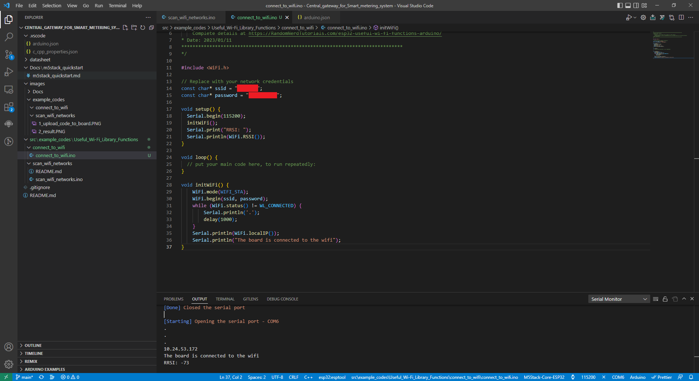

# Connect to a Wi-Fi Network Example
## How to Use Example
#### Using Arduino IDE

* Before Compile/Verify, select the correct board: `Tools -> Board`.
* Select the COM port: `Tools -> Port: xxx` where the `xxx` is the detected COM port.

#### Using VScode

* Make Sure that all configurations are correct and you have selected the correct file to upload.
* Upload the code with the upload button on the top + right side of the IDE. Or simply press `Ctrl + Alt + U`.
* The code starts to upload

## Example/Log Output

```
.
.
.
10.24.53.172
The board is connected to the wifi
RRSI: -73
```

<p align="center">
  
</p>
