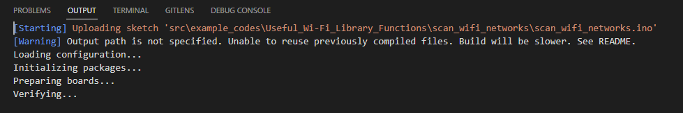
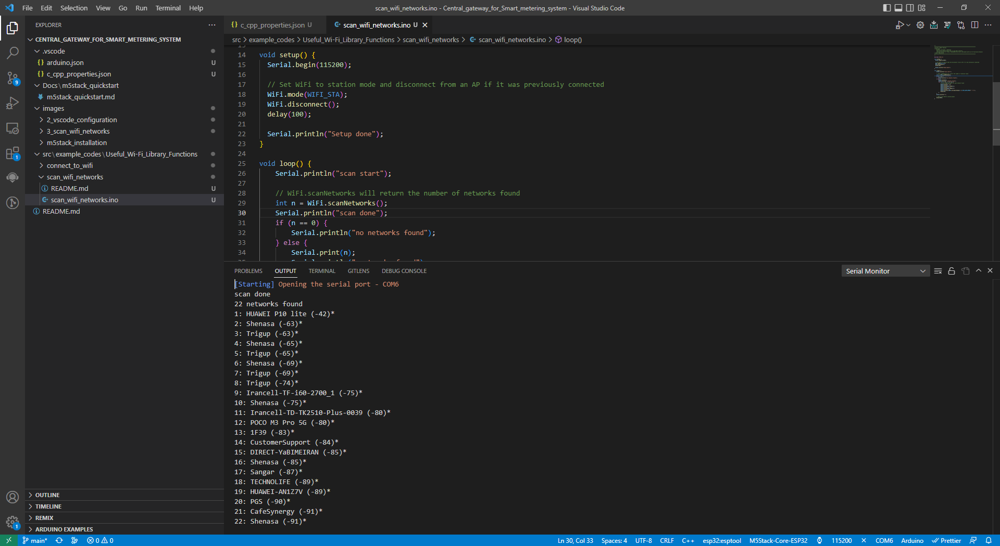

# WiFiScan Example
## How to Use Example
#### Using Arduino IDE

* Before Compile/Verify, select the correct board: `Tools -> Board`.
* Select the COM port: `Tools -> Port: xxx` where the `xxx` is the detected COM port.

#### Using VScode

* Make Sure that all configurations are correct and you have selected the correct file to upload.
* Upload the code with the upload button on the top + right side of the IDE. Or simply press `Ctrl + Alt + U`.
* The code starts to upload:
<p align="center">
  
</p>

## Example/Log Output

```
scan done
22 networks found
1: HUAWEI P10 lite (-42)*
2: Shenasa (-63)*
3: Trigup (-63)*
4: Shenasa (-65)*
5: Trigup (-65)*
6: Shenasa (-69)*
7: Trigup (-69)*
8: Trigup (-74)*
9: Irancell-TF-i60-2700_1 (-75)*
...
```

<p align="center">
  
</p>
