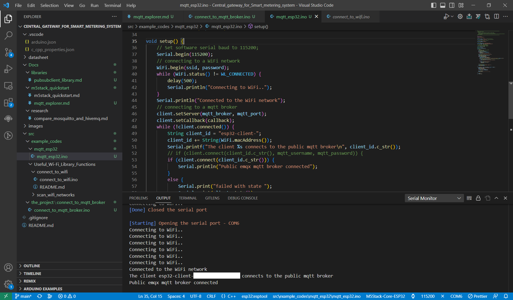

# Connect to a MQTT broker Example

The purpose of this code is to connect the mqtt broker "test.mosquitto.org". To reach this goal, it first connects to Wi-Fi in the `setup` function. It then tries to connect the specified broker.

There are several ways to connect a broker using the `connect()` function in PubSubClient library. One of the simplelest ways is just using client id which demonstraits in the example code. The `client_id` string is used for this purpose. It can be any string you want, just note that it must be special so that the broker will recognizes it as a different connected device.

## How to Use Example
#### Using Arduino IDE

* Before Compile/Verify, select the correct board: `Tools -> Board`.
* Select the COM port: `Tools -> Port: xxx` where the `xxx` is the detected COM port.

#### Using VScode

* Make Sure that all configurations are correct and you have selected the correct file to upload.
* Upload the code with the upload button on the top + right side of the IDE. Or simply press `Ctrl + Alt + U`.
* The code starts to upload

## Example/Log Output

```
Connecting to WiFi..
Connecting to WiFi..
Connecting to WiFi..
Connecting to WiFi..
Connecting to WiFi..
Connecting to WiFi..
Connected to the WiFi network
The client aut-esp32-client-ff:ee:ff:ee:ff:ee connects to the public mqtt broker
Public emqx mqtt broker connected
```

<p align="center">
  
</p>
